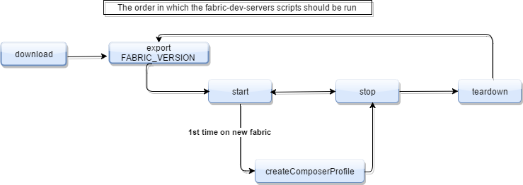

# Hyperledger Composer Getting Started

Follow the instructions below to get started by standing up a Hyperledger Fabric, and then getting a simple Hyperledger Composer Business Network deployed and an application running against it. 

There are two version of Hyperledger Fabric : v0.6 and v1.0-alpha.  The default is for v1.0-alpha and we suggest this is the one you use.

## Step 1: Getting Hyperledger Fabric running

These scripts use Node v6, and bash, which are Hyperledger Composer depencies. Choose a directory that you wish to have the setup scripts within. 

1. In a directory of your choice (will assume ~/tools) get the zip file that contains the tools
```
$ mkdir ~/tools && cd ~/tools
$ curl -O https://raw.githubusercontent.com/mbwhite/composer-tools/master/fabric-dev-servers/fabric-dev-servers.zip
$ unzip fabric-dev-servers.zip
```

2. Choose which version of Fabric to use. For v0.6

```
$ export FABRIC_VERSION=hlfv0.6
```

For v1.0-alpha, there is nothing to as this the default. But to 'unset' the v0.6, or to be explicit use this command

```
$ export FABRIC_VERSION=hlfv1
```

3. If this is the first time, you'll need to download the fabric, start the fabric, and create a Composer profile.  After that you can then choose to either stop the fabric, and start it again later. Alternatively to completely clean up you can teardown the Fabric and the Composer profile.

All the scritps will be in the directory `~/tools/fabric-dev-servcers`  A typical sequence  for Hyperledger Composer use would be

```
$ cd ~/tools/fabric-dev-servers
$ ./downloadFabric.sh
$ ./startFabric.sh
$ ./createComposerProfile.sh
```

Then at the end of your development session

```
$ cd ~/tools/fabric-dev-servers
$ ./stopFabric.sh
$ ./teardownFabric.sh
```

*If you want to swap between v0.6 and v1.0, ensure you have issued a STOP and a TEARDOWN command first be START on the other version*

### Downloading Fabric

Issue from the `fabric-dev-servers` directory
```
$ ./downloadFabric.sh
```

### Starting Fabric

Issue  from the `fabric-dev-servers` directory
```
$ ./startFabric.sh
```

### Stop Fabric

Issue from the `fabric-dev-servers` directory
```
$ ./stop.sh
```

### Create Composer Profile

Issue from the `fabric-dev-servers` directory
```
$ ./createComposerProfile.sh
```

Note: this create a Hyperledger Composer profile specifically to connect to the development fabric you've already started. 

### Teardown Fabric

Issue from the `fabric-dev-servers` directory
```
$ ./teardownFabric.sh
```


### Command Ordering

This diagram should to clarify the order in which the scripts can be run.  Remember the version will default to hlfv1 if the version command is not run. 

.


# Step 2: Getting the Composer sample application

0. Make sure you've started Fabric as in Step 1!

1. Clone the sample application into a directory of your choice - BUT not the same directory as in Step1. 
```
$ cd ~/github
$ git clone https://github.com/mbwhite/composer-sample-applications
$ cd composer-sample-applications
```

2. Choose which version of Fabric to use. For v0.6
```
$ npm set getting-started:fabricversion hlfv0.6
```

For v1.0-alpha, there is nothing to as this the default. But to 'unset' the v0.6, or to be explicit use this command

```
$ npm set getting-started:fabricversion hlfv1
```

*Note: this does not change the application source code or the model, purely the name of the Composer profile to use, and the Fabric's admin indentity*

3. Setup the dependancies
```
$ cd packages/getting-started
$ npm install
```

4. Deploy the business network

```
$ npm run deployNetwork
```

5. Run the sample application 
```
$ npm test
```

# Step 3: And next
To recap, a fabric has been started, and the Composer framework has been deployed to the Fabric, along with a sample business network. 
An application that uses this network has been run.

## Troubleshooting 
A useful information node.js script has been created to show the currently set versions and also to list running docker containers. 
```
$ node info.js
```


